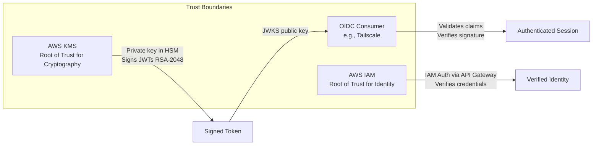

# Security Policy

## Security Model

AWS OIDC Token Exchange is designed to securely exchange AWS IAM credentials for OIDC tokens using cryptographic signing via AWS KMS.

### Trust Model



### Security Properties

**Guaranteed**:
- Identity verification before token issuance (via AWS IAM authentication)
- Cryptographic proof of token authenticity
- Tamper-proof tokens (signature verification fails if modified)
- Short-lived credentials (configurable, default varies by deployment)
- Audit trail via CloudWatch Logs

**Not Guaranteed**:
- Protection against credential theft (if AWS creds stolen, attacker can get tokens)
- Token revocation (no revocation mechanism)
- Protection after token interception (use HTTPS)
- Audience-based authorization enforcement (see Authorization Boundaries below)

### Authorization Boundaries

**This service is a domain bridge, not an authorization control.**

**What This Service Does:**
- Authenticates AWS IAM identities via AWS IAM (API Gateway)
- Translates verified AWS identity into OIDC token claims
- Signs tokens cryptographically with KMS
- Includes caller-specified audience in token claims

**What This Service Does NOT Do:**
- Validate whether a caller should access a specific audience
- Enforce policies like "Role X can only request audience Y"
- Restrict which audiences can be requested
- Make authorization decisions about service access

**How Authorization Works:**

This service verifies "This is really AWS role X" but does NOT verify "Role X should access service Y". The service takes an AWS IAM identity and an audience claim as input, and produces a signed OIDC token with verified identity claims as output.

The OIDC consumer (Relying Party) receives the token and makes the authorization decision. The consumer verifies the token signature (proving authenticity), validates claims (issuer, audience, expiration), applies its own access policies based on identity claims, and ultimately decides whether the presented identity should be granted access.

**Example:**

An AWS role `arn:aws:iam::123456789012:role/DatabaseWorker` can request:
- `audience=tailscale` → Gets valid token with `aud: tailscale`
- `audience=vault` → Gets valid token with `aud: vault`
- `audience=anything` → Gets valid token with `aud: anything`

The OIDC consumer (Tailscale, Vault, etc.) decides whether to grant access based on:
- Token signature verification (proves authenticity)
- Audience claim matching their expected value
- Other claims (AWS account, role name, etc.) matching their policies
- Their own authorization rules (ACLs, policies, etc.)

**Security Implications:**

1. **Access Control Point**: Use IAM policies to restrict which identities can invoke the API Gateway endpoint
2. **Audience is an Assertion**: The audience claim is the caller's statement of intent, not an enforced restriction
3. **Trust the Consumer**: OIDC consumers must implement their own authorization logic
4. **Monitor Patterns**: Watch CloudWatch logs for suspicious audience patterns or token usage

**This matches standard OIDC provider behavior**: Google Cloud Workload Identity, GitHub Actions OIDC, and other identity providers issue tokens for any audience requested by authenticated callers. Authorization enforcement happens at the Relying Party.

## Threat Model

### Threats We Mitigate

#### 1. Token Forgery
**Threat**: Attacker creates fake tokens

**Mitigation**:
- KMS signs all tokens with private key in HSM
- OIDC consumers verify signature using JWKS
- Signature verification fails for forged tokens

#### 2. Token Tampering
**Threat**: Attacker modifies token claims

**Mitigation**:
- JWT signature covers header and payload
- Any modification invalidates signature
- Signature verification detects tampering

#### 3. Invalid Credential Use
**Threat**: Attacker uses invalid AWS credentials

**Mitigation**:
- API Gateway IAM authorizer validates credentials
- Invalid credentials result in 403 error
- No tokens issued for invalid credentials

#### 4. Private Key Exposure
**Threat**: Private signing key is stolen

**Mitigation**:
- Private key never leaves KMS HSM
- KMS provides FIPS 140-2 Level 2 validated HSMs
- Sign operations only, no export capability

### Threats We Don't Fully Mitigate

#### 1. Credential Theft
**Threat**: Attacker steals valid AWS credentials

**Risk**: Attacker can request valid tokens

**Residual Risk**:
- Token lifetime limits exposure window
- CloudWatch logging provides audit trail
- IAM policies can restrict which credentials can get tokens

**Recommendations**:
- Use short-lived AWS credentials (STS temporary credentials)
- Enable CloudTrail for AWS API auditing
- Monitor CloudWatch logs for unusual patterns
- Use IAM Conditions to restrict API Gateway access

#### 2. Token Interception
**Threat**: Attacker intercepts token in transit

**Risk**: Attacker can use token until expiration

**Residual Risk**:
- HTTPS required but not enforced at application level
- No mutual TLS by default

**Recommendations**:
- Always use HTTPS for token requests
- Consider mutual TLS for high-security environments
- Use network segmentation
- Enable VPC endpoints for API Gateway

#### 3. OIDC Consumer Compromise
**Threat**: OIDC consumer (e.g., Tailscale) is compromised

**Risk**: Attacker gains access to what tokens grant

**Residual Risk**:
- This solution doesn't protect against downstream compromise
- Tokens are valid if consumer is compromised

**Recommendations**:
- Follow OIDC consumer's security best practices
- Use least-privilege access policies
- Monitor consumer access patterns
- Implement defense in depth

#### 4. Token Replay
**Threat**: Attacker replays intercepted token

**Risk**: Token valid until expiration

**Residual Risk**:
- No per-request nonce by default
- Same token can be used multiple times

**Recommendations**:
- Use short token lifetime
- OIDC consumer should implement additional checks
- Consider adding nonce for high-security use cases

## Token Lifetime Security

### What Token Lifetime Protects Against

The token lifetime limits the window of opportunity for several attack scenarios:

#### 1. Token Theft/Interception
**Threat**: Attacker intercepts or steals an OIDC token

**How Short Lifetime Helps**:
- Token becomes invalid after expiration
- Attacker must use stolen token within a narrow window
- Reduces time available for exploitation
- Limits damage if token is logged, leaked, or exposed

**Example**: If a token is accidentally committed to a Git repository or logged to a file, it expires quickly, limiting the exposure window.

#### 2. Credential Compromise Window
**Threat**: AWS credentials are compromised

**How Short Lifetime Helps**:
- Attacker can only mint tokens while AWS credentials remain valid
- Shorter token lifetime = less time between AWS credential rotation and token expiration
- Reduces the persistence of attacker access after credential revocation
- Forces more frequent token minting (more audit trail entries)

**Example**: If an attacker steals AWS credentials at 10:00 AM and you revoke them at 10:30 AM, tokens minted at 10:29 AM expire quickly, not hours later.

#### 3. Delayed Token Revocation Response
**Threat**: Tokens cannot be directly revoked before expiration

**How Short Lifetime Helps**:
- Credential revocation becomes effective faster
- Reduces time between detecting compromise and actual access termination
- Complements AWS credential rotation strategies
- Aligns with incident response timelines

**Example**: After detecting suspicious activity, revoking AWS credentials stops new tokens immediately, but existing tokens remain valid until expiration. With short-lived tokens, access ends much sooner.

#### 4. Session Persistence After Authentication
**Threat**: Relying Party maintains long-lived sessions based on OIDC tokens

**Partial Protection**:
- Token expiration doesn't necessarily end Relying Party sessions
- However, shorter tokens reduce the initial trust window
- Some Relying Parties may re-validate tokens or tie session lifetime to token expiration
- Limits exposure if Relying Party behavior changes

**Note**: This depends heavily on Relying Party implementation - token lifetime may or may not affect session duration.

### What Token Lifetime Does NOT Protect Against

Token lifetime is **not a silver bullet**. It does NOT protect against:

1. **Active Credential Theft**: If attacker has live access to AWS credentials, they can mint new tokens continuously
2. **Initial Access**: Short lifetime doesn't prevent the first token from being issued to a compromised identity
3. **Relying Party Compromise**: If the OIDC consumer is compromised, token lifetime is irrelevant
4. **Token Reuse**: Same token can be used multiple times within its lifetime
5. **Session Extensions**: Relying Parties may establish sessions that outlive the token

### Token Lifetime Trade-offs

#### Short Token Lifetimes (5-15 minutes)

**Security Benefits**:
- ✅ Minimal exposure window for stolen/leaked tokens
- ✅ Fast effective credential revocation
- ✅ Reduced blast radius for token compromise
- ✅ Aligns with zero-trust security principles
- ✅ Better for high-sensitivity environments

**Operational Costs**:
- ❌ More frequent token exchange calls
- ❌ More AWS API calls (KMS Sign, API Gateway)
- ❌ Higher AWS costs
- ❌ More CloudWatch log entries
- ❌ Potential for rate limiting issues at scale
- ❌ Client applications must handle re-authentication more frequently

**Recommendations**:
- Use for high-security environments
- Use when token theft risk is high (e.g., tokens traverse untrusted networks)
- Use when fast credential revocation is critical

#### Long Token Lifetimes (1-2 hours)

**Operational Benefits**:
- ✅ Fewer token exchange calls
- ✅ Lower AWS API costs
- ✅ Reduced operational overhead
- ✅ Less strain on rate limits
- ✅ Simpler client implementations
- ✅ Better for batch/scheduled workloads

**Security Risks**:
- ❌ Longer exposure window if token is stolen (up to 1-2 hours)
- ❌ Slower effective credential revocation
- ❌ Greater blast radius for token leaks
- ❌ Misaligned with zero-trust principles
- ❌ Harder to audit and track token usage

**Recommendations**:
- Consider for low-sensitivity workloads
- Use in trusted network environments
- Use when cost optimization is priority over security
- Implement additional compensating controls (network segmentation, monitoring)

#### Choosing the Right Balance

| Use Case | Recommended Lifetime | Rationale |
|----------|---------------------|-----------|
| Production workloads (general) | 10-30 minutes | Balances security and practicality |
| High-security environments | 5-10 minutes | Minimal exposure, fast revocation |
| Development/testing | 30-60 minutes | Reduces friction during testing |
| Batch/scheduled jobs | 15-30 minutes | Covers typical job duration |
| Interactive sessions | 10-15 minutes | Acceptable re-auth frequency |
| Cost-sensitive deployments | 30-60 minutes | Reduces API calls |

### Re-authentication Pattern

When tokens expire, there is **no refresh token mechanism**. Simply repeat the token exchange request:

```bash
# Token expires
# Just call the endpoint again with your AWS credentials
curl -X GET "https://your-api-gateway-url/token?audience=tailscale" \
  --aws-sigv4 "aws:amz:us-east-2:execute-api" \
  --user "${AWS_ACCESS_KEY_ID}:${AWS_SECRET_ACCESS_KEY}" \
  --header "x-amz-security-token: ${AWS_SESSION_TOKEN}"
```

**This is by design**:
- Simpler implementation (no refresh token storage/rotation)
- Same security model (AWS credentials remain the source of truth)
- No additional state to manage
- Easier to reason about security properties

Client applications should implement automatic re-authentication before token expiration (e.g., refresh when 80% of lifetime has elapsed).

## Security Best Practices

### Deployment Security

#### 1. Restrict API Gateway Access

Use resource policies and IAM conditions to restrict access:

```json
{
  "Version": "2012-10-17",
  "Statement": [
    {
      "Effect": "Allow",
      "Principal": "*",
      "Action": "execute-api:Invoke",
      "Resource": "arn:aws:execute-api:region:account:api-id/*",
      "Condition": {
        "StringEquals": {
          "aws:PrincipalOrgID": "o-your-org-id"
        }
      }
    }
  ]
}
```

#### 2. Enable CloudWatch Alarms

Monitor for security events:

```bash
# High error rate
aws cloudwatch put-metric-alarm \
  --alarm-name token-exchange-high-errors \
  --comparison-operator GreaterThanThreshold \
  --evaluation-periods 2 \
  --metric-name 4XXError \
  --namespace AWS/ApiGateway \
  --period 300 \
  --statistic Sum \
  --threshold 10

# Unusual invocation count
aws cloudwatch put-metric-alarm \
  --alarm-name token-exchange-high-invocations \
  --comparison-operator GreaterThanThreshold \
  --evaluation-periods 1 \
  --metric-name Count \
  --namespace AWS/ApiGateway \
  --period 300 \
  --statistic Sum \
  --threshold 1000
```

#### 3. Enable AWS CloudTrail

Track all KMS and IAM operations:

```bash
aws cloudtrail create-trail \
  --name oidc-audit-trail \
  --s3-bucket-name my-cloudtrail-bucket \
  --include-global-service-events \
  --is-multi-region-trail
```

### Operational Security

#### 1. Rotate KMS Keys Regularly

While KMS doesn't support automatic rotation for asymmetric keys, rotate manually:

- **Frequency**: Every 6-12 months
- **Process**: Create new key, update Lambda, wait for old tokens to expire, delete old key
- **Downtime**: None (JWKS can expose multiple keys)

#### 2. Monitor Token Usage

Create CloudWatch Insights queries:

```cloudwatch
# Token issuance by identity
fields @timestamp, @message
| filter @message like /Token generated/
| parse @message /identity: (?<identity>[^\s,]+)/
| stats count() by identity

# Failed authentication attempts
fields @timestamp, @message
| filter @message like /Authentication failed/
| stats count() by bin(5m)
```

#### 3. Regular Security Audits

- Review CloudWatch Logs monthly
- Audit IAM policies quarterly
- Review KMS key policies
- Test token verification regularly
- Update dependencies promptly

### Development Security

#### 1. Never Log Sensitive Data

**BAD**:
```javascript
console.log('Credentials:', accessKey, secretKey);
console.log('Token:', token);
```

**GOOD**:
```javascript
console.log('Token exchange request received', {
  path: event.path,
  method: event.httpMethod
  // No credentials or tokens
});
```

#### 2. Validate All Inputs

```javascript
// Validate audience
if (audience && !audience.match(/^[a-zA-Z0-9-_]+$/)) {
  throw new Error('Invalid audience format');
}
```

## Known Security Limitations

### 1. No Token Revocation

**Limitation**: Tokens cannot be revoked before expiration

**Impact**: If credentials are compromised, attacker can use tokens until expiry

**Workarounds**:
- Use short token lifetime
- Rotate AWS credentials immediately if compromised
- Monitor for suspicious token usage
- OIDC consumer may implement additional checks

### 2. No Mutual TLS

**Limitation**: API Gateway doesn't require client certificates by default

**Impact**: Cannot cryptographically verify client identity beyond IAM

**Workarounds**:
- Use VPC endpoints and security groups
- Implement IP whitelisting via resource policies
- Enable mutual TLS on API Gateway if needed

### 3. Limited Rate Limiting

**Limitation**: Default API Gateway throttling only

**Impact**: DDoS or brute force attacks possible

**Workarounds**:
- Configure API Gateway throttling limits
- Enable AWS WAF
- Implement application-level rate limiting
- Monitor and alert on unusual patterns

### 4. Same Token Reuse

**Limitation**: Same token can be used multiple times

**Impact**: Replay attacks possible within token lifetime

**Workarounds**:
- Use short token lifetime
- OIDC consumer should track token usage
- Add nonce claim for critical operations
- Implement additional request authentication

## Incident Response

### If AWS Credentials Are Compromised

1. **Immediately**:
   - Disable the compromised IAM user/role
   - Rotate all credentials
   - Review CloudWatch logs for token requests

2. **Within token lifetime**:
   - Wait for tokens to expire
   - Review OIDC consumer access logs
   - Identify what resources were accessed

3. **Within 24 hours**:
   - Complete security assessment
   - Implement additional controls
   - Update incident response procedures

### If KMS Key Is Suspected Compromised

**Note**: KMS private keys cannot be exported, making true compromise unlikely

1. **Immediately**:
   - Create new KMS key
   - Update Lambda functions to use new key
   - DO NOT delete old key yet

2. **Within token lifetime**:
   - Wait for tokens signed with old key to expire
   - Verify OIDC consumers recognize new JWKS

3. **After token expiration**:
   - Schedule old KMS key deletion (7-day waiting period)
   - Review KMS CloudTrail logs
   - Document incident

### If Token Is Leaked

1. **Assess Impact**:
   - Check token expiration time
   - Identify what token grants access to
   - Review access logs from OIDC consumer

2. **Immediate Actions**:
   - Cannot revoke token directly
   - Disable underlying AWS credentials if possible
   - Monitor for unauthorized usage

3. **Short Term** (within token lifetime):
   - Block access at OIDC consumer level if possible
   - Monitor all activity closely

4. **Long Term**:
   - Reduce token lifetime if needed
   - Implement additional security controls
   - Review credential handling procedures

## Vulnerability Disclosure

### Reporting Security Issues

**DO NOT** create public GitHub issues for security vulnerabilities.

Instead:
1. Email security concerns to your security team
2. Include:
   - Description of vulnerability
   - Steps to reproduce
   - Potential impact
   - Suggested fix (if any)

## Compliance Considerations

### HIPAA

This solution uses HIPAA-eligible AWS services:
- Lambda: HIPAA eligible
- KMS: HIPAA eligible
- API Gateway: HIPAA eligible
- CloudWatch: HIPAA eligible

Requirements:
- Sign AWS BAA
- Enable encryption at rest (KMS does this)
- Implement access controls
- Maintain audit logs

### PCI DSS

Considerations for payment card environments:
- KMS provides cryptographic key management
- CloudWatch Logs provide audit trail
- Regular security testing required
- Network segmentation recommended

### GDPR

If tokens contain personal data:
- Document what data is in tokens
- Implement data minimization
- Provide ability to stop token issuance
- Maintain audit logs for access requests

## Security Checklist

Before deploying to production:

- [ ] Review and restrict API Gateway access via resource policies
- [ ] Enable CloudWatch alarms for errors and unusual activity
- [ ] Configure CloudTrail for audit logging
- [ ] Test token verification with JWKS
- [ ] Implement monitoring and alerting
- [ ] Document incident response procedures
- [ ] Review IAM policies for least privilege
- [ ] Enable MFA for AWS accounts with admin access
- [ ] Test backup and recovery procedures
- [ ] Review security documentation with team
- [ ] Schedule regular security reviews
- [ ] Set up vulnerability scanning
- [ ] Configure AWS Config rules
- [ ] Enable AWS GuardDuty if not already enabled
- [ ] Review VPC security if using private API Gateway

## Additional Resources

- [AWS KMS Best Practices](https://docs.aws.amazon.com/kms/latest/developerguide/best-practices.html)
- [AWS API Gateway Security](https://docs.aws.amazon.com/apigateway/latest/developerguide/security.html)
- [OIDC Security Considerations](https://openid.net/specs/openid-connect-core-1_0.html#Security)
- [OWASP Top 10](https://owasp.org/www-project-top-ten/)
- [CIS AWS Foundations Benchmark](https://www.cisecurity.org/benchmark/amazon_web_services)
