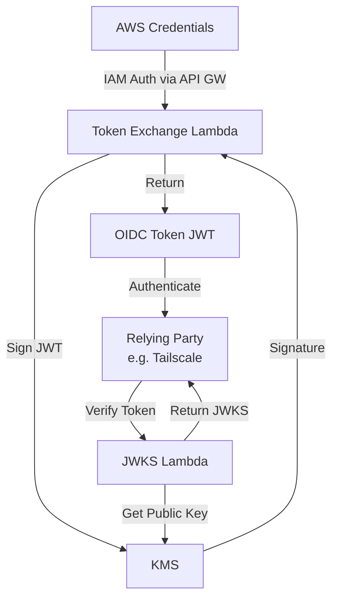
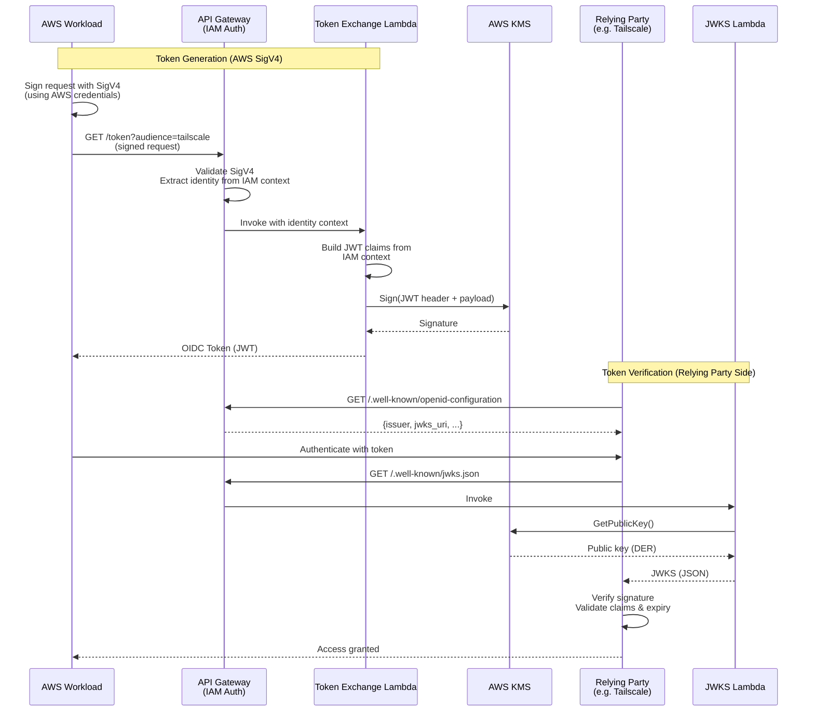

# AWS OIDC Token Exchange

Exchange AWS authentication for OIDC tokens using KMS-backed signing.

## ⚠️ Production Deployment Considerations

**This project provides infrastructure for exchanging AWS credentials for OIDC
tokens.** Before deploying to production:

- Conduct a security review appropriate for your organization
- Test extensively in a non-production environment
- Understand the security implications (see [SECURITY.md](./SECURITY.md))
- Review the
  [blog post](https://www.latacora.com/blog/2025/11/04/aws-oidc-workload-identity/)
  for design rationale

Use at your own risk and ensure it meets your organization's security
requirements.

## What is Workload Identity?

**Workload identity** allows services and applications (workloads) to
authenticate themselves using cryptographically verifiable tokens instead of
long-lived secrets. Each workload gets a unique identity that can be verified
without sharing credentials.

### Why Use Workload Identity?

Traditional authentication with static API keys or passwords has significant
drawbacks:

- Long-lived secrets that can be stolen or leaked
- Manual rotation is error-prone and disruptive
- Hard to audit who accessed what and when
- Difficult to revoke without breaking other systems

Workload identity solves these problems:

- ✅ Short-lived tokens (typically minutes to hours) that automatically expire
- ✅ Cryptographic verification prevents token forgery
- ✅ Fine-grained access control based on verified identity claims
- ✅ Automatic rotation - no manual credential management
- ✅ Complete audit trail of authentication attempts
- ✅ Instant revocation by changing policy, not rotating secrets

### Understanding OIDC Roles

Workload identity is a general security concept that can be implemented using
various protocols. This project uses OIDC because it's a widely-supported open
standard, particularly useful with Tailscale's Workload Identity feature.

In OIDC-based workload identity, there are two key roles defined by the
[OpenID Connect specification](https://openid.net/specs/openid-connect-core-1_0.html):

**OpenID Provider (OP)** - Issues signed tokens asserting identities

- Generates and signs JWT tokens with identity claims
- Provides a JWKS endpoint with public keys for verification
- Provides a discovery endpoint at `.well-known/openid-configuration`
- Examples for workload identity:
  - GitHub Actions (issues OIDC tokens for CI/CD workflows)
  - Google Cloud (issues ID tokens for service accounts, Cloud Run, GKE, etc.)
  - This project (issues OIDC tokens for AWS workloads)

**Relying Party (RP)** - Accepts and verifies tokens to authenticate identities

- Retrieves public keys from the OP (via JWKS)
- Verifies token signatures and validates claims
- Makes authorization decisions based on verified identity
- Examples:
  - Tailscale (accepts OIDC tokens for workload authentication)
  - HashiCorp Vault (accepts OIDC tokens for secrets access)
  - AWS (accepts external OIDC tokens via `AssumeRoleWithWebIdentity`)
  - Kubernetes (verifies service account tokens)

This project is an OpenID Provider: it issues OIDC tokens that assert AWS
identities. These tokens can then be used to authenticate with any Relying
Party that accepts them.

#### Relevant Specifications

This project implements:

- [OpenID Connect Core 1.0](https://openid.net/specs/openid-connect-core-1_0.html) -
  Defines OP and RP roles, ID Token format
- [OpenID Connect Discovery 1.0](https://openid.net/specs/openid-connect-discovery-1_0.html) -
  Defines the `.well-known/openid-configuration` endpoint
- [RFC 7519 (JWT)](https://www.rfc-editor.org/rfc/rfc7519) - JSON Web Token
  format and claims
- [RFC 7518 (JWA)](https://www.rfc-editor.org/rfc/rfc7518) - JSON Web
  Algorithms (signing algorithms)
- [RFC 7517 (JWK)](https://www.rfc-editor.org/rfc/rfc7517) - JSON Web Key
  format for JWKS endpoint

This project implements RS256 signing (RSASSA-PKCS1-v1_5 with SHA-256), which
is required by RFC 7518.

### The Problem: AWS ↔ OIDC Gap

AWS supports authenticating _to_ AWS via OIDC (see
`AssumeRoleWithWebIdentity`), allowing external OIDC tokens to access AWS
resources. However, AWS does not provide the reverse: there's no built-in way
for AWS workloads to obtain OIDC tokens that external services can verify.

Your AWS workloads (EC2, ECS, Lambda) have strong IAM-based identities, but
they can't use them to authenticate with services that only accept OIDC tokens.

### This Project: Bridging the Gap

This project implements a minimal, secure AWS → OIDC token exchange service
using:

- AWS KMS for cryptographic signing (private key never leaves AWS)
- AWS Lambda for serverless token generation
- AWS API Gateway for HTTP endpoints with IAM authentication

Your AWS workloads can now authenticate to any Relying Party that accepts OIDC
tokens, such as:

- [Tailscale](https://tailscale.com/kb/1581/workload-identity-federation) -
  Zero-trust networking
- [HashiCorp Vault](https://developer.hashicorp.com/vault/docs/auth/jwt) -
  Secrets management
- [AWS](https://docs.aws.amazon.com/IAM/latest/UserGuide/id_roles_providers_create_oidc.html) -
  Cross-account or multi-cloud access
- [Google Cloud](https://cloud.google.com/iam/docs/workload-identity-federation) -
  Access GCP resources from AWS
- Custom applications - Any service using standard JWT verification libraries

## Overview

Deploys an API gateway + lambda that can be used to exchange AWS authentication
for an OIDC token signed by a KMS key. Also implements metadata and jwks
endpoints to act as an OIDC provider.

You can read more about the design and benefits here:
https://www.latacora.com/blog/2025/11/04/aws-oidc-workload-identity/

## Architecture

### High-Level Architecture



### Token Exchange Flow



### Endpoints

An API gateway and single lambda is deployed that exposes three endpoints:

**Public endpoints:**

- `GET /.well-known/openid-configuration` : OIDC metadata endpoint
- `GET /.well-known/jwks.json` : OIDC JWKS endpoint

**Authenticated endpoint** (requires AWS IAM authentication from a principal in
your AWS organization):

- `GET /token` : OIDC token minting endpoint

You can then exchange tokens minted from the token endpoint for authentication
in other services, like Tailscale, that support federated workload identities.

## Security Properties

- Cryptographic security: Uses AWS KMS with RSA-2048, preventing private key
  exposure
- Identity verification: AWS IAM authentication verified by API Gateway before
  token issuance
- No credential transmission: Credentials never sent over network - only AWS
  SigV4 signatures
- Short-lived tokens: Configurable lifetime (recommended: 10-30 minutes)
- Immutable audit trail: All operations logged to CloudWatch
- No stored secrets: Everything derives from AWS IAM and KMS
- Tamper-proof: JWT signatures cryptographically prevent token modification
- AWS native: Uses standard AWS authentication - works with all AWS credential
  sources

For Tailscale integration specifically:

- Zero secret keys to manage
- Your workloads exchange existing authentication (roles) for tokens that
  Tailscale verifies and trusts
- Signing done entirely by KMS - private key never leaves dedicated hardware
  modules in AWS
- Combine claim validations in Tailscale with tags and ACLs to precisely
  control workload access

See [SECURITY.md](./SECURITY.md) for comprehensive security documentation
including threat model, security best practices, and incident response
procedures.

### Infrastructure Costs

The infrastructure costs are minimal, we expect no more than a few dollars a
month even for heavy usage.

### Provisioning

Deploy the Terraform using this module. Specify the domain and hosted_zone_id
to create a stable well-known name for your issuer.

```terraform
module "token_exchange" {
  source           = "github.com/latacora/aws-oidc-token-exchange"
  name             = "aws-oidc-token-exchange"
  default_audience = "<SOME_DEFAULT_AUDIENCE>"
  domain           = "token-exchange.example.com"
  hosted_zone_id   = "EXAMPLEHOSTEDZONEID"
  principal_org_id = "EXAMPLEAWSORGANIZATIONID"
}
```

### Token Claims

The following claims are made available from the AWS identity inside the OIDC
token claims. These are all things you can choose to validate in Tailscale when
configuring the OIDC provider.

```json
[
  "aws:account",
  "aws:arn",
  "aws:arn:partition",
  "aws:arn:service",
  "aws:arn:region",
  "aws:arn:account",
  "aws:arn:resource_type",
  "aws:arn:resource_name",
  "aws:arn:role_name",
  "aws:arn:session_name",
  "aws:user_id",
  "aws:caller_id",
  "aws:access_key",
  "aws:principal_org_id",
  "aws:source_ip",
  "aws:user_agent"
]
```

### Accessing Public Endpoints

Accessing the OIDC metadata:

```bash
curl -sS https://token-exchange.example.com/.well-known/openid-configuration | jq
```

Accessing the OIDC JWKS:

```bash
curl -sS https://token-exchange.example.com/.well-known/jwks.json | jq
```

---

### Configuring Tailscale and minting a token for your workload

Add a new OIDC provider to Tailscale here:
https://login.tailscale.com/admin/settings/trust-credentials.

Choose the claims you wish to validate and assign appropriate scopes / tags to
the workloads that authenticate via this provider. Note that while this example
would allow access for any principal in the AWS organization you probably
should validate additional claims like the AWS Account and Role Name.


Have your workloads mint an OIDC token using your AWS credentials and the
appropriate Tailscale audience it generated when you saved the configuration.
You probably want to build this step into your instance userdata or
container/sidecar entrypoint.

```bash
curl -sS "https://token-exchange.example.com/token?audience=<your-tailscale-audience>" \
    --aws-sigv4 aws:amz:us-east-2:execute-api \
    --user "${AWS_ACCESS_KEY_ID}:${AWS_SECRET_ACCESS_KEY}" \
    --header "x-amz-security-token: ${AWS_SESSION_TOKEN}" \
    --header "Accept: application/json"
```

Join your tailnet via the OIDC token. Specify the same tags you used in the
Tailscale configuration and provide the client ID generated by Tailscale when
you saved the configuration.

```bash
tailscale up \
  --advertise-tags=<your-authorized-tailscale-tags>
  --client-id=<your-tailscale-client-id>\?ephemeral=false\&preauthorized=true \
  --id-token=<your-oidc-token> \
  --accept-routes
```
